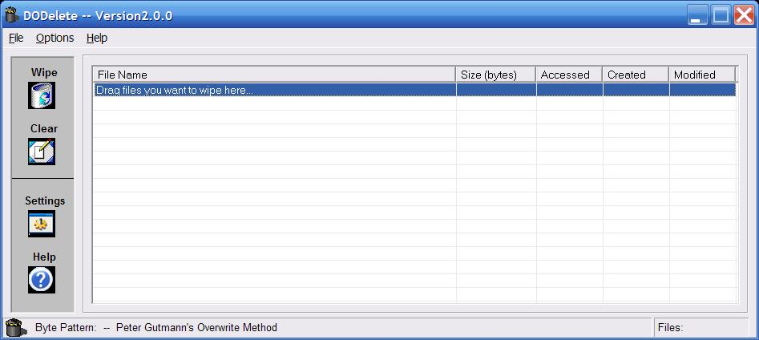



## DODelete

### Description

Very fast file wipe and delete application.

Selectable overwrite patterns of DOD 5220.22-M standard and the Peter Gutmann overwrite method.

This program uses the CreateFile, WriteFile and FlushFileBuffers API. Therefore it is much faster than programs that use the PRINT statement and (in theory) much more secure. Updated GUI with recursive file operations. Please read the ReadMe file!!
 
### More Info
 

             |
---                |---
**Submitted On**   |2006-05-19 22:34:12
**By**             |[FliptBit](https://github.com/Planet-Source-Code/PSCIndex/blob/master/ByAuthor/fliptbit.md)
**Level**          |Advanced
**User Rating**    |4.8 (24 globes from 5 users)
**Compatibility**  |VB 5\.0, VB 6\.0
**Category**       |[Files/ File Controls/ Input/ Output](https://github.com/Planet-Source-Code/PSCIndex/blob/master/ByCategory/files-file-controls-input-output__1-3.md)
**World**          |[Visual Basic](https://github.com/Planet-Source-Code/PSCIndex/blob/master/ByWorld/visual-basic.md)
**Archive File**   |[DODelete1996875252006\.zip](https://github.com/Planet-Source-Code/fliptbit-dodelete__1-65302/archive/master.zip)

